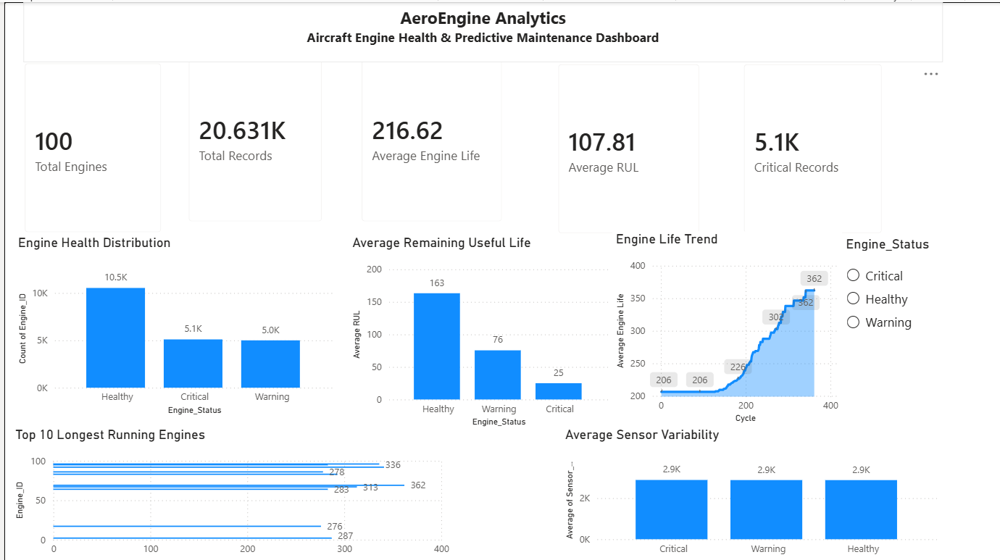

# ✈️ AeroEngine Analytics: Aircraft Engine Health & Predictive Maintenance

## 📌 Project Overview

AeroEngine Analytics is a data analytics project focused on understanding aircraft engine degradation using the NASA CMAPSS turbofan engine dataset.

The project demonstrates a complete analytics workflow, including data profiling, cleaning, exploratory data analysis (EDA), feature engineering, statistical analysis, SQL-based business queries, and an interactive Power BI dashboard.

The objective is to generate actionable insights that can support predictive maintenance and improve operational reliability.

---

## 🎯 Business Problem

Aircraft engine failures are costly and can lead to operational disruptions and increased maintenance expenses.

The goal of this project is to:

- Analyze engine operational data.
- Identify degradation patterns.
- Estimate Remaining Useful Life (RUL).
- Support condition-based maintenance decisions.
- Provide executive-level insights through interactive dashboards.

---

## 📊 Dashboard Preview



---

## 📂 Dataset

- **Dataset:** NASA CMAPSS Turbofan Engine Degradation Simulation Dataset (FD001)
- **Source:** NASA Prognostics Center of Excellence
- **Records:** 20,631
- **Unique Engines:** 100
- **Operational Settings:** 3
- **Sensor Measurements:** 21 (reduced after preprocessing)

---

## 🛠️ Tech Stack

- Python
- Pandas
- NumPy
- Matplotlib
- Seaborn
- SQLite (SQL Analysis)
- Power BI
- Jupyter Notebook

---

## 📁 Project Structure

```text
AeroEngine_Analytics/
│
├── dashboard/
│   └── Dashboard.pbix
│
├── data/
│   ├── raw/
│   └── processed/
│
├── images/
│   ├── dashboard.png
│   ├── engine_health_distribution.png
│   ├── average_rul.png
│   ├── engine_life_trend.png
│   ├── top10_engines.png
│   └── sensor_variability.png
│
├── notebooks/
│   ├── 01_Business_Understanding.ipynb
│   ├── 02_Dataset_Understanding.ipynb
│   ├── 03_Data_Profiling.ipynb
│   ├── 04_Data_Cleaning.ipynb
│   ├── 05_Exploratory_Data_Analysis.ipynb
│   ├── 06_Feature_Engineering.ipynb
│   ├── 07_Statistical_Analysis.ipynb
│   ├── 08_SQL_Analysis.ipynb
│   └── 09_Business_Insights_and_Executive_Recommendations.ipynb
│
├── README.md
├── requirements.txt
└── .gitignore
```

---

## 🔍 Project Workflow

1. Business Understanding
2. Dataset Understanding
3. Data Profiling
4. Data Cleaning
5. Exploratory Data Analysis
6. Feature Engineering
7. Statistical Analysis
8. SQL Analysis
9. Business Insights & Executive Recommendations
10. Power BI Dashboard

---

## 📈 Key Insights

- Engine lifespan varies significantly across the fleet.
- Remaining Useful Life (RUL) helps identify engines requiring immediate maintenance.
- Sensor variability highlights potential operational instability.
- Engine health categories simplify maintenance prioritization.
- High-quality operational data supports reliable analytics and decision-making.

---

## 💡 Business Recommendations

- Adopt condition-based maintenance instead of fixed maintenance schedules.
- Prioritize inspections for engines with low Remaining Useful Life.
- Continuously monitor engines with high sensor variability.
- Implement automated alerts for critical engines.
- Develop predictive maintenance systems using engineered features.

---

## 📊 Power BI Dashboard Features

- Fleet KPI Cards
- Engine Health Distribution
- Average Remaining Useful Life
- Engine Life Trend
- Top 10 Longest Running Engines
- Sensor Variability Analysis
- Interactive Slicers

---

## 🚀 Skills Demonstrated

- Data Cleaning
- Exploratory Data Analysis
- Feature Engineering
- Statistical Analysis
- SQL
- Power BI Dashboard Development
- Business Analytics
- Data Visualization
- Predictive Maintenance Concepts

---

## 👨‍💻 Author

**Jainesh**

Aspiring Data Analyst | Python | SQL | Power BI | Data Analytics