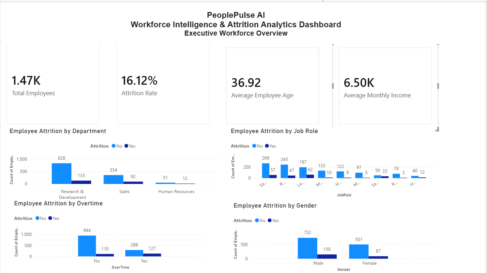
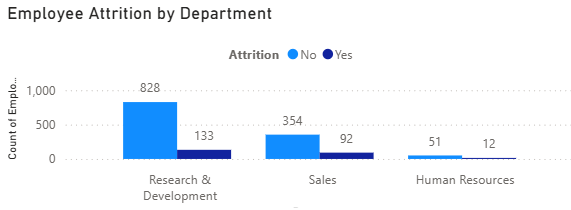
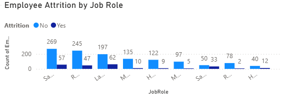
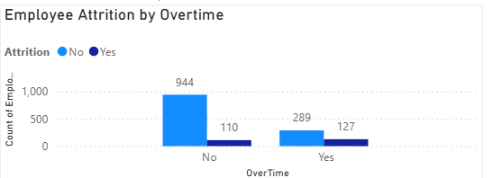
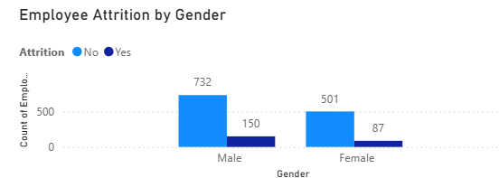

# 🧠 PeoplePulse AI – Workforce Intelligence & Attrition Analytics Platform

An end-to-end Workforce Intelligence and HR Analytics project built using **Python, Pandas, Matplotlib, Seaborn, Jupyter Notebook, and Power BI**.

The project analyzes employee attrition patterns, identifies workforce trends, and provides executive-level recommendations to improve employee retention through data-driven decision-making.

---
## Skills Demonstrated

- Python
- Pandas
- NumPy
- Data Cleaning
- Exploratory Data Analysis
- Data Visualization
- Power BI
- DAX
- Business Intelligence
- Executive Reporting

## 📊 Executive Dashboard



---

# 📌 Project Overview

Employee attrition is one of the most significant challenges faced by organizations. High employee turnover increases recruitment costs, affects productivity, and impacts organizational performance.

PeoplePulse AI was developed to analyze workforce data, identify the major factors influencing employee attrition, and provide actionable business recommendations using data analytics.

The project follows a complete analytics lifecycle, from business understanding and data cleaning to exploratory analysis, executive reporting, and dashboard development.

# 🎯 Business Problem

The HR department wants to understand:

- Why are employees leaving the organization?
- Which departments experience the highest attrition?
- Does overtime contribute to employee turnover?
- Which job roles are most affected?
- How can HR reduce employee attrition using data-driven insights?

# 🚀 Project Objectives

- Clean and preprocess employee workforce data.
- Perform exploratory data analysis (EDA).
- Identify patterns influencing employee attrition.
- Build executive-level KPIs.
- Create professional Power BI dashboards.
- Generate actionable HR recommendations.

# 📂 Dataset Information

- Dataset: IBM HR Analytics Employee Attrition Dataset
- Total Employees: **1,470**
- Features: **35**
- Target Variable: **Attrition**

The dataset contains demographic, job-related, compensation, satisfaction, and performance information for employees.

## Project Highlights

- Analyzed 1,470 employee records.
- Built 4 executive KPIs.
- Created an interactive Power BI dashboard.
- Delivered HR retention recommendations.

# 🛠 Tech Stack

### Programming

- Python

### Libraries

- Pandas
- NumPy
- Matplotlib
- Seaborn

### Business Intelligence

- Power BI
- DAX

### Development Tools

- Jupyter Notebook
- VS Code
- Git
- GitHub

# 🔄 Project Workflow

Business Understanding

↓

Dataset Understanding

↓

Data Cleaning

↓

Exploratory Data Analysis

↓

Business Insights

↓

Power BI Dashboard

↓

Executive Recommendations

# 📊 Dashboard Highlights

### Employee Attrition by Department



### Employee Attrition by Job Role



### Employee Attrition by Overtime



### Employee Attrition by Gender



# 📈 Key Business Insights

- Research & Development experienced the highest number of employee exits.
- Employees working overtime showed significantly higher attrition.
- Certain job roles demonstrated consistently higher turnover.
- Employee attrition varied across departments and workforce demographics.
- Workforce analytics enables HR teams to proactively identify retention risks.

# 💼 Executive Recommendations

- Reduce excessive overtime.
- Improve employee engagement programs.
- Strengthen onboarding for new employees.
- Develop clear career progression plans.
- Use predictive analytics to identify high-risk employees.
- Build continuous HR monitoring dashboards.

# 📁 Project Structure

```text
PeoplePulse_AI/
│
├── data/
├── notebooks/
├── dashboard/
├── images/
├── README.md
├── requirements.txt
└── LICENSE
```

# ▶️ How to Run

1. Clone the repository.

```bash
git clone https://github.com/yourusername/PeoplePulse_AI.git
```

2. Install dependencies.

```bash
pip install -r requirements.txt
```

3. Open the notebooks or launch the Power BI dashboard.

# 🚀 Future Enhancements

- Build a Machine Learning model to predict employee attrition.
- Deploy the project as a web application.
- Integrate real-time HR data.
- Develop advanced workforce forecasting models.

# 👨‍💻 Author

**Jainesh Patel**

Aspiring Data Analyst | Future AI Engineer

If you found this project interesting, feel free to connect and provide feedback.
